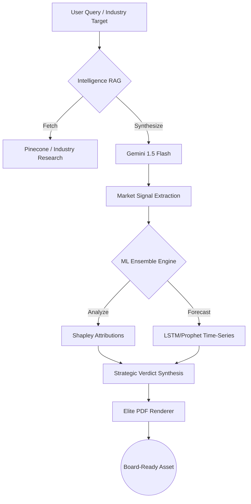
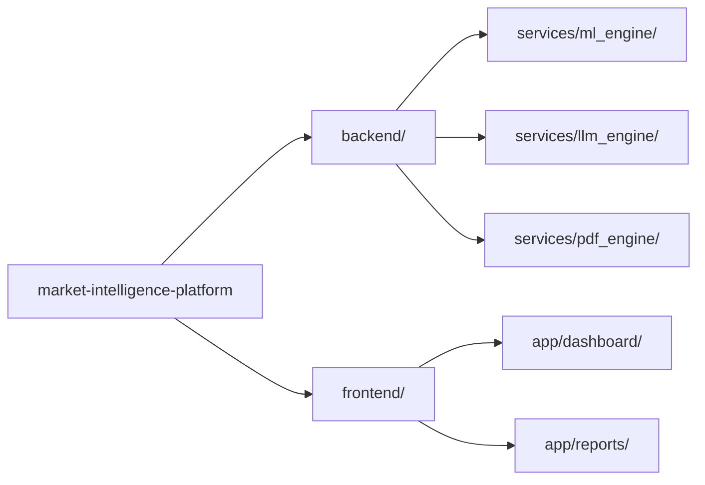

# 📈 Market Intelligence Platform (V2 Strategy Engine)

[](https://render.com)
[](https://deepmind.google/technologies/gemini/)
[](https://fastapi.tiangolo.com/)
[](https://nextjs.org/)

**A premium, enterprise-grade Market Intelligence & Predictive Analytics platform.** This system synthesizes real-time market signals, industry-specific ML modeling, and RAG-driven research into "Board-Ready" strategic consultancy reports.

---

## 🚀 System Architecture & Workflow

### 🧠 Intelligence Path (RAG to PPT/PDF)
The platform uses a sophisticated multi-stage pipeline to transform raw market noise into actionable strategy.



### 📂 Monorepo Structure


---

## ✨ Elite Feature Suite

- **💎 Partner-Level Consultancy**: Reports adopt a "Big Three" (McKinsey/BCG) strategic voice.
- **🔍 AI-Powered Explainability**: Real-time SHAP attributions visualize EXACTLY what drives market movements.
- **📊 Industry-Specific ML**: Custom inference engines for Pharmaceuticals, Tech, Cosmetics, and Printing.
- **🎙️ Intelligence RAG**: Deep-dive conversational interface querying thousands of synthesized market points.
- **📄 Pro PDF Generation**: Automated 3-page strategic masterplans with custom Emerald-on-Slate styling.

---

## 🛠️ Tech Stack

- **Backend**: Python 3.11, FastAPI, Uvicorn, Pydantic V2.
- **AI/ML**: Google Gemini 1.5 Flash, XGBoost, Scikit-learn, MLflow (Observability).
- **Frontend**: Next.js 14 (App Router), TypeScript, TailwindCSS, Framer Motion (Animations).
- **Data/Infra**: PostgreSQL, Redis, Docker, Render Blueprints.

---

## ⚙️ Local Setup

### 1. Backend
```bash
cd backend
python -m venv venv
venv\Scripts\activate
pip install -r requirements.txt
uvicorn backend.main:app --reload
```

### 2. Frontend
```bash
cd frontend
npm install
npm run dev
```

**Required Environment Variables (`.env`):**
- `GEMINI_API_KEY`: Your Google AI Studio key.
- `NEXT_PUBLIC_BACKEND_URL`: `http://localhost:8000` (Local).

---

## 🚢 Deployment (Render)

This project is cloud-ready with a pre-configured `render.yaml` Blueprint.

1. Push this repository to your GitHub.
2. On **Render Dashboard**, click **New +** ➔ **Blueprint**.
3. Select this repository.
4. Set the `GEMINI_API_KEY` in the service environment variables.
5. Launch!

---

## 📜 License
Privately developed for high-fidelity market research. All Rights Reserved.
